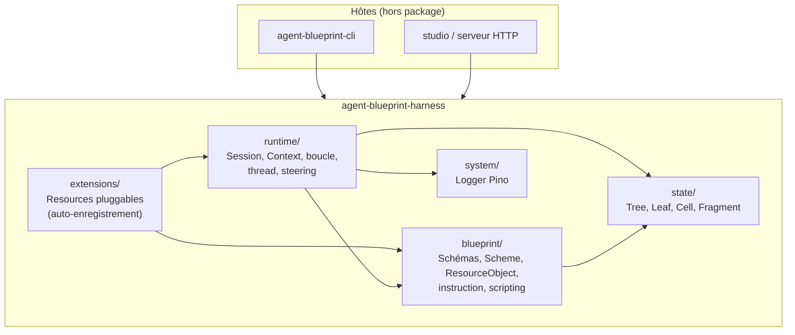
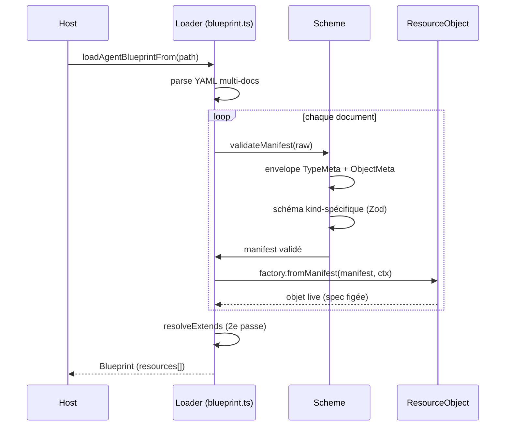
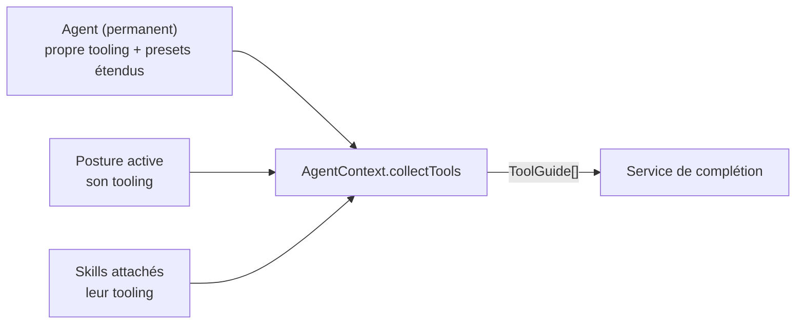
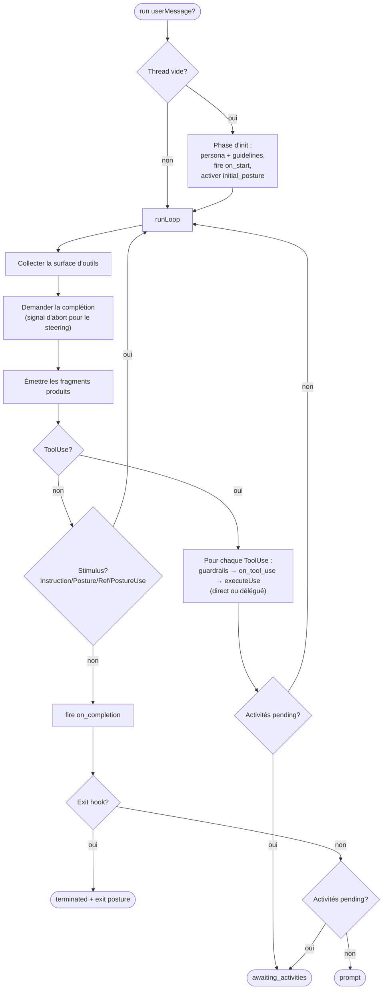
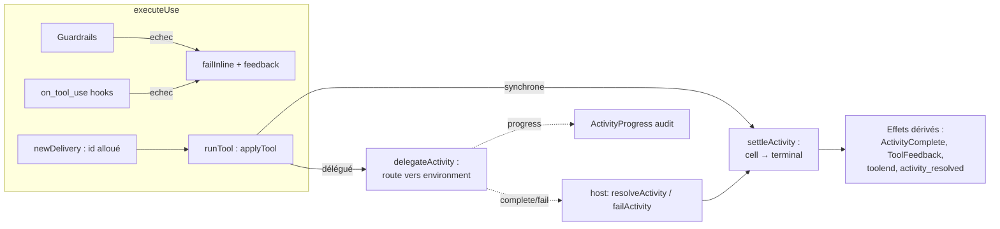
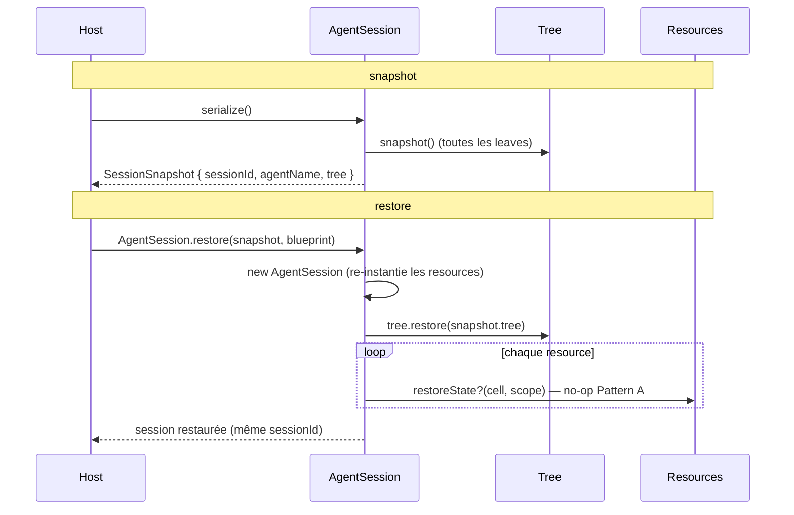

# Spécification d'architecture — `agent-blueprint-harness`

> Runtime déclaratif pour agents LLM. Ce document décrit l'architecture du
> package `@kanop.ai/agent-blueprint-harness` : ses frontières, ses couches,
> ses invariants et ses flux. Il complète [`concepts.md`](./concepts.md) (le
> modèle mental) en fixant la structure interne du code.

## Frontières du package

Le package est le **moteur d'agent** publié sous le scope `@kanop.ai/`. Il est
consommé par deux hôtes distincts, qu'il ne connaît pas :

- **`@kanop.ai/agent-blueprint-cli`** (repo séparé) — interface en ligne de
  commande : validation, introspection, lancement du studio.
- **tout host embarqué** (serveur HTTP, batch, TUI) qui construit un `Blueprint`
  et pilote un `AgentSession` via `execute()` + événements.

L'invariant de dépendance est strict : **le harness n'importe jamais le CLI ni
aucun host**. Le sens est `host → harness`. Le harness expose sa surface publique
via un unique barrel `src/index.ts`.

C'est un **fork** du projet kanop.ai (commit `98b210a`), destiné au projet
agent wynsure. Le versionning est indépendant (`0.1.x`).

## Les quatre couches

Le code est organisé en quatre couches d'abstraction strictement empilées,
chacune avec une responsabilité unique. La fondation ne connaît rien des
couches supérieures ; chaque couche ne dépend que de celles en dessous d'elle.

### `state/` — la fondation Tree / Leaf / Cell

Micro-filesystem générique, **session-agnostic** et entièrement sérialisable.
Aucune référence à l'agent, au blueprint ou au runtime : c'est un pur modèle
d'adressage par chemin.

Trois notions imbriquées :

- **Cell** — le plus petit élément stocké. Un discriminant `kind` plus un
  `activityId` optionnel. La cellule est du JSON plat.
- **Leaf** — conteneur ordonné de Cell adressé par un chemin POSIX relatif au
  Tree. Possède deux styles de mutation : *append* (ordonné, pour les threads)
  et *upsert-by-kind* (dernier-gagne, pour l'état). La Leaf est l'unité de
  sérialisation.
- **Tree** — racine propriétaire de toutes les Leaf d'une session. Résout les
  chemins lexicalement (pas de lien parent stocké). Le chemin réservé `/.session`
  héberge l'état de portée session pour ne jamais collisionner avec un id de
  contexte (les ids sont opaques).

Cette couche est ce qui rend les projections de la session (thread agent,
projection utilisateur, état de resource) **unifiées sous un seul vocabulaire** :
chacune est une `Leaf<Cell>` typée. La spécialisation (`AgentThread extends
Leaf<Fragment>`) se fait par factory au moment de l'acquisition.

### `blueprint/` — la couche déclarative

Le **quoi** d'un agent, sans aucune exécution. Transforme un fichier YAML en
objets typés en mémoire.

Pièces maîtresses :

- **TypeMeta** `(apiVersion, kind)` — le contrat de schéma d'une ressource. La
  paire group/version ouvre une voie de migration non-cassante (`agent/v2` peut
  coexister avec `agent/v1`).
- **ObjectMeta** — identité + relations transversales partagées par toutes les
  ressources : `name` (identifiant stable), `labels` (sélectionnables),
  `annotations` (libres, non sélectionnables). Tout le reste kind-spécifique
  vit dans `spec`.
- **Scheme** — le registre unique process-wide `(apiVersion, kind) → { schéma
  de manifest, factory, metadata }`. Chaque module de ressource s'y enregistre
  une fois par side-effect d'import. Il remplace deux registres parallèles
  (validation + loader) qui devaient être synchronisés à la main.
- **ResourceObject** — le contrat runtime que tout objet chargé implémente :
  `getTools`, `getHooks`, `getGuardrails`, `applyTool`, `getService?`,
  `captureState?` / `restoreState?`, `bindToSession?`, `toManifest`. Les membres
  optionnels (`?`) sont les seams que les extensions exploitent sans que le
  cœur les câble.
- **ToolingSchema** — les trois entrées déclaratives qui composent la surface
  d'outils : `toolset` (sélection depuis d'autres ressources), `route`
  (transition de posture exposée comme outil), `subagent` (délégation à un
  autre agent).
- **InstructionTemplate** — une instruction résolue (frontmatter + corps), avec
  exigences en outils/variables. Le rendu `{{expr}}` est délégué à
  `blueprint/scripting` (expressions JS réelles, via
  `@jointhedots/scripting`).
- **ServiceContract** — une clé de capacité typée. Une ressource qui implémente
  une capacité (ex. la complétion de thread) la publie via `getService(contract)`;
  un consommateur la résout par contrat, sans couplage au kind concret.

Le seam **Manifest ↔ Object** est exactement bidirectionnel : `fromManifest`
construit l'objet live (spec figée), `toManifest` le resérialise. La composition
par `extends` produit un **nouvel** objet plutôt que de muter l'existant —
d'où la round-trippabilité : sérialiser un objet reflète toujours ce qui a été
réellement chargé.

### `runtime/` — la couche live

Le **comment l'agent tourne**, à un instant t. Trois responsabilités :

- **AgentSession** — la surface host. Possède l'EventEmitter, l'identité de
  session, le registre des **environnements** (accepteurs d'activités externes),
  et le registre des contextes. Alloue les ids. Route la résolution d'activité
  (host-driven) vers le contexte propriétaire. C'est aussi la façade du Tree
  pour la portée session (`/.session/state`).
- **AgentContext** — la boucle de run d'un agent. Construit la surface d'outils,
  demande au service de complétion de produire des fragments, exécute les tool
  calls, reboucle jusqu'à épuisement puis signale `prompt`. Un sous-agent n'est
  qu'un autre contexte, niché sous son parent, avec sa propre racine d'activité.
  Possède **deux racines d'activité** par contexte : `modelActivityId` (ce que
  le LLM produit) et `harnessActivityId` (ce que le harness produit :
  instructions, hooks, activité déléguée). La distinction pilote le filtrage
  fournisseur (assistant vs contexte/audit).
- **AgentThread** — une `Leaf<Fragment>` spécialisée, à `${contextPath}/thread` :
  la mémoire ordonnée des fragments produits par l'agent.

L'exécution d'un tool call est soit **directe** (la ressource livre un résultat,
enveloppé en feedback synchrone), soit **déléguée** (la ressource décrit une
activité confiée à un environnement externe, qui streame du progrès puis un
statut terminal). Les outils `interact__*` sont une instance de ce motif :
le kind déclare via `pinned` s'il backe sa réponse par une activité.

### `system/` — observabilité

Un logger Pino configurable par variables d'environnement (`HARNESS_LOG_PATH`,
`HARNESS_LOG_LEVEL`, `HARNESS_DEBUG`). Sortie fichier par défaut ; activation
console via `enableConsoleLogging()`. Écrit aussi des fichiers de trace
contextuels en mode debug. Couche isolée, sans logique métier.

### `extensions/` — resources pluggables

Barrel de resources qui s'auto-enregistrent dans le `scheme` au moment de
l'import. **Le cœur du harness n'importe jamais ce barrel** : le supprimer
laisse un cœur minimal compilable et exécutable avec le jeu de resources de
base (Agent, Posture, Skill, Preset).

Chaque extension enregistre son kind via `scheme.register(...)` puis
re-exporte ses types publics. Les extensions actuelles :

| Extension | Rôle |
|---|---|
| `openai-completion` | Les kinds `OpenAIModel` / `OllamaModel` / `AzureFoundryModel` — fournisseurs du `ThreadCompletionService`. Partagent un `BaseModelObject` (build paresseux + cache du service). |
| `mcp-stdio` | Kind `McpStdio` — serveur MCP sur transport stdio persistant. |
| `mcp-server` | Kind `McpServer` — serveur MCP distant (HTTP Streamable / SSE), avec auth `none` / `apiKey` / `oauth` (client_credentials). |
| `mcp-deno-worker` | Kind exécutant un worker MCP Deno isolé. |
| `memory` | Kind `Memory` — magasin clé/volatile volatile par contexte (Pattern A : l'état vit dans la Leaf, la ressource est stateless). |
| `interact-surface` | Kind `InteractSurface` — publie les outils `interact__*` et **possède** la projection utilisateur (Leaf `/interact` typée). Porte aussi l'accepteur passif `UserBoardEnvironment`. |

L'extension `interact-surface` illustre le seam de projection : le runtime
émet des événements génériques `fragment` et `activity_resolved` sans jamais
se projeter vers une surface utilisateur ; l'extension s'abonne (via
`bindToSession`) et maintient sa propre Leaf. Supprimer l'extension laisse un
runtime valide, simplement sans surface utilisateur.

## Le cycle Manifest → Object

Toute ressource issue d'un blueprint passe par un chemin unique :

Deux passes : d'abord la construction de chaque objet (factory kind-spécifique),
puis la **résolution des `extends`** — chaque agent/posture/skill qui déclare
`spec.extends: [...]` est reconstruit avec ses presets fusionnés. La deuxième
passe existe pour que l'ordre de déclaration des presets soit indifférent.
L'objet fusionné **remplace** l'original dans la liste des resources.

## Les kinds, groupés par rôle

Tous les kinds vivent sous `agent/v1`. Quatre rôles suffisent pour les retenir.

| Rôle | Kinds | Responsabilité |
|---|---|---|
| **Agent et ses états** | `Agent`, `Posture`, `Skill`, `Preset` | Le comportement. `Agent` est la persona racine ; `Posture` est un état actif ; `Skill` est un bundle toggleable ; `Preset` est un conteneur de config partagée, inerte tant que rien ne l'`extends`. |
| **Le cerveau** | `OpenAIModel`, `OllamaModel`, `AzureFoundryModel` | Fournisseurs purs du `ThreadCompletionService`. Pas d'outils, pas de surface. |
| **Sources d'outils** | `McpStdio`, `McpServer`, `McpDenoWorker`, `Memory` | Chacun publie un set d'outils appelables. Ne contribuent à la surface que si un `toolset` les sélectionne. |
| **Surface utilisateur** | `InteractSurface` | Publie `interact__*` et possède la projection conversation. |

Deux invariants structurels :

- **La surface est opt-in.** Une source d'outils présente dans le blueprint ne
  fait **rien** tant qu'une entrée `toolset` ne la sélectionne pas (par nom ou
  par sélecteur de labels). Aucune agrégation implicite des `getTools()`.
- **Seuls contribuent la posture active et les skills attachés.** Une posture
  inactive n'apporte ni outils ni routes. Les transitions de posture ne sont
  jamais globales : la seule façon d'atteindre une posture est une entrée
  `type: route` dans le tooling de la posture ou de l'agent initiateur.

## La surface d'outils, assemblée à l'instant t

À chaque itération de la boucle, la collection d'outils montrée au modèle
s'assemble depuis **trois canaux**, dans un ordre fixe :

Chaque entrée de tooling est un des trois types : `toolset` (sélectionne des
outils depuis d'autres resources), `route` (expose une transition comme outil),
`subagent` (délègue à un autre agent). Ce qui n'est pas sélectionné par ces
canaux n'existe tout simplement pas pour le modèle.

## La boucle de run

L'`AgentContext` orchestre un tour de conversation :

Trois issues terminales possibles : `prompt` (fin de tour normal, la posture
persiste), `terminated` (un hook exit a fermé le tour), `awaiting_activities`
(une livraison est différée — la boucle se suspend et le host rappelle
`execute()` après résolution).

## Le modèle d'activité : data, pas de promesses

L'invariant le plus structurant du runtime : **une activité est une cellule**,
pas une promesse. Chaque invocation d'outil obtient une activité (un id alloué
par le harness, stocké dans la Leaf `/activities` du contexte). La résolution
est une **mutation synchrone de donnée** : la cellule passe à `completed` ou
`failed`, et les effets (ToolFeedback, audit, flip d'item interact, événements)
se **dérivent** de la donnée.

Il n'y a **pas de graphe d'await en mémoire, pas de watcher map, pas de reprise
par promesse**. Le host pilotant la session re-calle `execute()` pour continuer
après une résolution. C'est ce qui rend la session reproductible et inspectable :
tout l'état d'exécution est dans le Tree, rien dans des closures.

## Le Tree, source de vérité unique

L'invariant central : **le Tree de la session est la source de vérité ; le
thread en est une Leaf parmi d'autres.** Tout artefact runtime significatif vit
comme des cellules sérialisables adressées par chemin :

| Leaf | Chemin | Contenu |
|---|---|---|
| Thread | `${scopePath}/thread` | Les fragments (mémoire du LLM). Append-only. |
| État de resource | `${scopePath}/state` | Cellules `StateCell` (clé = nom de resource). Upsert. |
| Activités | `${scopePath}/activities` | Cellules `ActivityCell` (clé = id d'activité). |
| Interact | `${scopePath}/interact` | Items de conversation (projection utilisateur, possédée par l'extension). |
| État session | `/.session/state` | État de portée session (cross-contexte). |

La posture active et l'usage de tokens sont eux-mêmes des cellules intrinsèques
(clés réservées `__`-préfixées) dans la Leaf `/state` du contexte — plus des
caches dérivés, mais du vrai état rejouable.

Le `status` exposé par certains objects (état d'une connexion MCP, presets
fusionnés) est de l'**observation** produite par le système pour l'inspection ;
ce n'est jamais lui qui pilote le comportement.

## Sérialisation et restauration

Une session se snapshotte comme un tout : l'identité plus le Tree entier. Le
blueprint lui-même n'est pas sérialisé (le host le recharge depuis son chemin) ;
les handles transitoires (clients MCP, caches de modèle) se reconnectent
paresseusement.

Deux patterns d'état de resource cohabitents :

- **Pattern A** — la resource est stateless ; son état vit déjà dans la Leaf via
  `Context.setState` (ex. `Memory`). `captureState` retourne null, `restoreState`
  est un no-op.
- **Pattern B** — la resource projette son état instance dans une cellule via
  `captureState` et se réhydrate dans `restoreState` en reconstruisant ses
  handles transitoires (ex. un worker MCP qui re-recalcule ses capacités).

## Build, dev workflow et publication

**Exports conditionnels.** Le `exports` du package définit une condition
`development` qui pointe vers `src/index.ts` (fallback `dist/index.js` en prod).
Un CLI activant `customConditions: ["development"]` typecheck depuis la source,
et un host en `tsx watch --conditions development` exécute depuis la source.
Résultat : éditer `src/*.ts` est immédiatement visible côté host, sans rebuild.
Le `dist/` n'est requis que pour `npm publish` et l'exécution hors-dev.

**Build.** `tsup` bundle la surface publique (`src/index.ts`) en un fichier ESM
minifié + un fichier de déclarations rolloffé, renommé `dist/types.d.ts` par un
post-build script. Les dépendances restent externes.

**Publication.** Le hook `prepack` rebuild le `dist` puis exécute
`scripts/strip-dev-exports.mjs` qui retire la condition `development` du
tarball (afin qu'un consommateur de prod ne résolve jamais la source).
`postpack` la restaure dans la copie de travail. Scripts racines :
`build`, `typecheck` (`tsc --noEmit`), `test` (`tsx test/run.ts`), `release`
(`version:bump` + `npm publish --access public`), `pack` (tarball local sans
publier).

## Annexe — noms stables et vocabulaire

Le lien entre cette spec (FR) et le code (EN) se fait par les noms de concepts,
qui ne divergent jamais entre les deux :

- **Blueprint** → `Blueprint`, **Resource** → `ResourceObject`, **Manifest** →
  `ObjectManifest`.
- **Tree / Leaf / Cell** → mêmes noms en code.
- **Session** → `AgentSession`, **Context** → `AgentContext`, **Thread** →
  `AgentThread`.
- **Fragment** → `Fragment` (le discriminant est `kind`).
- **Activity** → `Activity` / `ActivityCell`, **Environment** →
  `ActivityEnvironment`, **Delivery** → `ActivityDelivery`.
- **Tooling** → `ToolingEntry`, **Toolset** → `toolset`, **Route** → `route`,
  **Subagent** → `subagent`.
- **Hook** → `HookEntry`, **Guardrail** → `GuardrailDecl`, **Preset** →
  `PresetView`.
- **Scheme** → `Scheme` (registre), **Contract** → `ServiceContract`.
