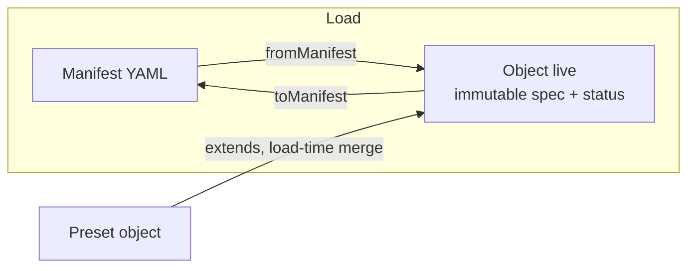
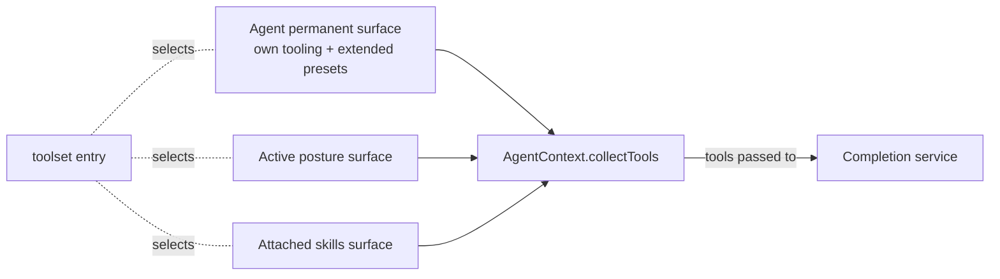

# Core concepts

A mental model for the agent-blueprint harness: what the pieces are, how they
fit together, and what is invariant. This document is the **why** and the **how
it composes**; for the exhaustive field-by-field reference of each resource
kind, see [`resources.md`](./resources.md).

## The blueprint is a declaration of intent

A *blueprint* is a single YAML file that declares **everything** an agent needs
to behave: its model, its persona, the states it can be in, the tools it can
call, and the safety checks that govern it. The design borrows directly from
the Kubernetes object/resource philosophy — you describe the **desired state**
in a manifest, and the harness turns it into **live behavior**.

A file holds many resources, separated by `---`. Each one is a *manifest*:

```yaml
apiVersion: agent/v1   # the schema contract (group/version)
kind: Agent            # the concrete type
metadata:
  name: <unique>       # the stable identifier everything else refers to by name
  labels: { ... }      # selectable attributes (used by toolset selectors)
  annotations: { ... } # free-form config (never selected)
spec:
  <kind-specific payload>
```

Three ideas flow from this and never change:

- **Name-based wiring.** Resources never hold pointers to each other; they hold
  *names* (`spec.model`, `initial_posture`, `tools: <resource>/*`). The harness
  resolves names at load time. Rename a resource and you update the names that
  point at it — nothing else.
- **Stateless files.** A blueprint file carries no runtime state. The same file
  produces the same behavior every time it is loaded.
- **Observation, not truth.** Some live objects expose a `status` (e.g. an MCP
  connection's state, the presets that were merged in). A `status` is produced
  by the system for inspection; it is never what drives behavior. The only
  runtime source of truth is the **thread** (see below).

## Manifest → Object: two forms, one seam

Every resource exists in two shapes joined by a single bidirectional seam:

- The **manifest** — the serialized form you write to disk or POST to an API.
  A plain, declarative object validated by a Zod schema.
- The **object** — the live, typed instance built in memory after loading. It
  carries the runtime contract (`getTools`, `getHooks`, `applyTool`) and an
  immutable `spec` (frozen after construction).

The seam is exactly two functions: `fromManifest` turns a manifest into its
object; `toManifest` turns it back. There is no other construction path for
resources that come from a blueprint. Because the `spec` is immutable and
composition (`extends`) produces a **new** object rather than mutating one in
place, objects are round-trippable: serializing an object always reflects what
was actually loaded.



## The resource kinds, grouped by role

There are nine kinds today, all under `agent/v1`. They fall into four clear
roles; you only need to hold the roles in your head, not the list.

| Role | Kinds | What they are for |
|---|---|---|
| **The agent & its states** | `Agent`, `Posture`, `Skill` | Behavior. The agent is the root persona; postures are its active states; skills are optional bundles it can switch on. |
| **The brain** | `OpenAIModel`, `OllamaModel`, `AzureFoundryModel` | Completion services. Pure providers of one typed contract; no tools, no surface. |
| **Tools** | `McpStdio`, `Memory` | Sources of callable tools. An MCP server (persistent stdio transport) and a volatile per-context key/value store. |
| **Reuse** | `Preset` | A container of shared configuration, inert until something `extends` it. |

Two properties are worth internalizing:

- **Surface is opt-in.** A tool source sitting in the blueprint does *nothing*
  until a tooling entry explicitly selects it. There is no implicit injection.
  A `Memory` or `McpStdio` resource must be referenced by a `toolset` entry
  (by name or by label selector) to become visible to the model.
- **Only the active posture and attached skills contribute.** An inactive
  posture contributes no tools and no routes. Posture transitions are *never*
  global; the only way to reach another posture is a `type: route` entry in the
  tooling of the posture (or agent) that initiates the move.

The complete field reference for each kind is in [`resources.md`](./resources.md).

## How the tool surface is assembled

At any moment, the collection of tools shown to the model is assembled from
exactly three channels, in a fixed order:

1. **Permanent** — the agent's own `spec.tooling`, followed by the tooling of
   any `Preset` it `extends`. This lives for the whole lifetime of the context.
2. **The active posture** — the `spec.tooling` of the posture currently in
   effect.
3. **Attached skills** — the `spec.tooling` of every skill the agent has
   switched on.

Each tooling entry is one of three kinds. `toolset` selects tools from other
resources (by name pattern `<resource>/<tools>`, or by label selector); `route`
exposes a posture transition as a tool the model can call; `subagent` delegates
to another agent. Whatever is not selected through these channels is simply not
there.



## Composition, not code

Behavior is composed declaratively through four primitives. None of them is a
hook into imperative logic — they are all data the harness interprets.

- **`extends`** — load-time merge. A `Preset`'s instruction, tooling and hooks
  fold into the agent/posture/skill that references it. It runs in a second
  pass after every resource is loaded, so declaration order does not matter, and
  it always yields a brand-new object. A preset that nothing extends is inert.
- **`route`** — the only way to move between postures. Declared in a posture's
  (or the agent's) tooling, it surfaces a tool whose effect is to activate a
  target posture. Reaching a posture "by its own name" is deliberately
  impossible.
- **`skills`** — toggleable bundles. Same shape as a posture, but the agent
  activates and deactivates them mid-conversation; while attached, their
  tooling and hooks join the surface.
- **`hooks` & `guardrails`** — the control layer (see
  [`hooks-guardrails.spec.md`](../../../docs/hooks-guardrails.spec.md)).
  `hooks` are automations tied to thread events (`on_start`,
  `on_completion`, `on_tool_use`, `on_tool_error`) that act purely through side
  effects. `guardrails` are assertions evaluated before a tool runs; a failing
  assertion blocks the call and returns a message to the model. Crucially, a
  hook never emits a `ToolUse` fragment — that audit type is reserved for calls
  the **model** originates.

## How an agent actually runs

The runtime has three layers, each with one clear job.

- **`Blueprint`** — the loaded set of resources. Resolves names, exposes
  services by typed contract. No execution.
- **`AgentContext`** — the per-agent *run loop*. It builds the tool surface,
  asks the completion service to generate, executes the resulting tool calls,
  and loops until the turn is done or the agent pauses for input. A
  sub-agent is just another context with its own roots.
- **`AgentSession`** — the thin host-facing surface. It owns the event emitter,
  allocates activity ids, registers external **environments**, and routes
  activity feedback back to the owning context.

Execution of a tool call is either **direct** (the resource returns a result,
wrapped immediately into feedback) or **delegated** (the resource describes an
*activity* handed to an external environment, which streams progress and then a
terminal status). User interactions (`interact__*`) are a delegated activity
under the standard `user-board` environment that every host must register. This
is what makes the same agent drivable from a terminal TUI, an HTTP server, or a
batch smoke test without changes to the blueprint. See
[`activities.spec.md`](../../../docs/activities.spec.md).

## The thread is the single source of truth

The most important invariant: **the thread is the source of truth; everything
else is a cache derived from it.** Every meaningful event — the active posture,
attached skills, spawned sub-agents, in-flight activities, the conversation
itself — is audited as an append-only stream of **fragments**. The current
state can always be reconstructed by replaying that stream. No parallel state
field in the session is authoritative; `status` on objects is observation, and
the volatile `Memory` store is, by design, never replayed.

This is what makes an agent inspectable, debuggable and replayable: if you can
see the fragments, you can understand exactly what happened and why, and the
behavior follows deterministically from the data.
