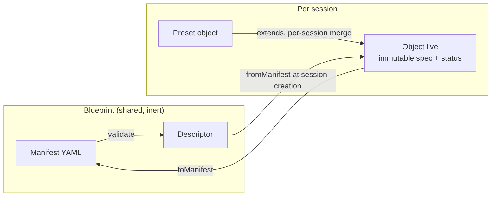
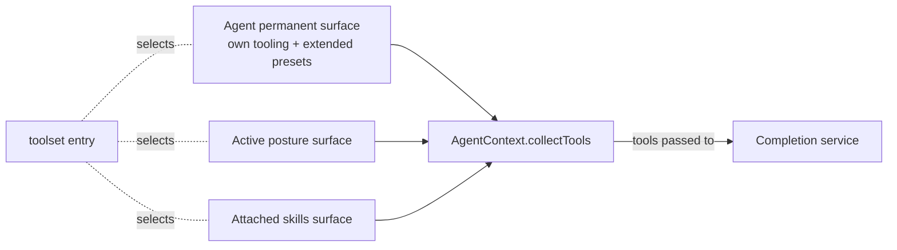

# Core concepts

A mental model for the agent-blueprint harness: what the pieces are, how they
fit together, and what is invariant. This document is the **why** and the **how
it composes**; for the exhaustive field-by-field reference of each resource
kind, see [`resources.md`](./resources.md).

## The blueprint is a declaration of intent

A *blueprint* is a single YAML file that declares **everything** an agent needs
to behave: its model, its persona, the states it can be in, the tools it can
call, and the safety checks that govern it. The design borrows directly from
the Kubernetes object/resource philosophy — you describe the **desired state**
in a manifest, and the harness turns it into **live behavior**.

A file holds many resources, separated by `---`. Each one is a *manifest*:

```yaml
apiVersion: agent/v1   # the schema contract (group/version)
kind: Agent            # the concrete type
metadata:
  name: <unique>       # the stable identifier everything else refers to by name
  labels: { ... }      # selectable attributes (used by toolset selectors)
  annotations: { ... } # free-form config (never selected)
spec:
  <kind-specific payload>
```

Three ideas flow from this and never change:

- **Name-based wiring.** Resources never hold pointers to each other; they hold
  *names* (`spec.model`, `initial_posture`, `tools: <resource>/*`). The harness
  resolves names at load time. Rename a resource and you update the names that
  point at it — nothing else.
- **Stateless files.** A blueprint file carries no runtime state. The same file
  produces the same behavior every time it is loaded.
- **Observation, not truth.** Some live objects expose a `status` (e.g. an MCP
  connection's state, the presets that were merged in). A `status` is produced
  by the system for inspection; it is never what drives behavior. The runtime
  source of truth is the session's **Tree** (see below): the thread, the
  resource state cells, the posture and token usage all live there.

And one boundary follows from all three: **a loaded blueprint is shared and
inert; live objects are per session.** Loading validates manifests into
descriptors and resolves instruction templates — nothing connects, nothing
mutates. When a session is created, each descriptor is instantiated into a
fresh live object (its own MCP transport, its own status) for that session
alone. Two sessions from one blueprint share the declaration, never the
objects.

## Manifest → Object: two forms, one seam

Every resource exists in two shapes joined by a single bidirectional seam:

- The **manifest** — the serialized form you write to disk or POST to an API.
  A plain, declarative object validated by a Zod schema.
- The **object** — the live, typed instance built in memory when a session is
  created. It carries the runtime contract (`getTools`, `getHooks`,
  `applyTool`) and an immutable `spec` (frozen after construction).

The seam is exactly two functions: `fromManifest` turns a manifest into its
object; `toManifest` turns it back. There is no other construction path for
resources that come from a blueprint. Because the `spec` is immutable and
composition (`extends`) produces a **new** object rather than mutating one in
place, objects are round-trippable: serializing an object always reflects what
was actually instantiated.



## The resource kinds, grouped by role

Every kind lives under `agent/v1` (hosts may register their own under other
apiVersions). They fall into five clear roles; you only need to hold the roles
in your head, not the list — the exhaustive, field-by-field catalogue is in
[`resources.md`](./resources.md).

| Role | Kinds | What they are for |
|---|---|---|
| **The agent & its states** | `Agent`, `Posture`, `Skill` | Behavior. The agent is the root persona; postures are its active states; skills are optional bundles it can switch on. |
| **The brain** | `OpenAIModel`, `OllamaModel`, `AzureFoundryModel` | Completion services. Pure providers of one typed contract; no tools, no surface. |
| **Tools** | `McpStdio`, `McpDirect`, `McpServer`, `McpDenoWorker`, `Memory` | Sources of callable tools. MCP servers over stdio, in-process, remote HTTP or a Deno worker; plus a volatile per-context key/value store. |
| **User surface** | `InteractSurface` | Publishes the `interact__*` tools and owns the user-facing projection. |
| **Reuse** | `Preset` | A container of shared configuration, inert until something `extends` it. |

Two properties are worth internalizing:

- **Surface is opt-in.** A tool source sitting in the blueprint does *nothing*
  until a tooling entry explicitly selects it. There is no implicit injection.
  A `Memory` or `McpStdio` resource must be referenced by a `toolset` entry
  (by name or by label selector) to become visible to the model.
- **Only the active posture and attached skills contribute.** An inactive
  posture contributes no tools and no routes. Posture transitions are *never*
  global; the only way to reach another posture is a `type: route` entry in the
  tooling of the posture (or agent) that initiates the move.

The complete field reference for each kind is in [`resources.md`](./resources.md).

## How the tool surface is assembled

At any moment, the collection of tools shown to the model is assembled from
exactly three channels, in a fixed order:

1. **Permanent** — the agent's own `spec.tooling`, followed by the tooling of
   any `Preset` it `extends`. This lives for the whole lifetime of the context.
2. **The active posture** — the `spec.tooling` of the posture currently in
   effect.
3. **Attached skills** — the `spec.tooling` of every skill the agent has
   switched on.

Each tooling entry is one of three kinds. `toolset` selects tools from other
resources (by name pattern `<resource>/<tools>`, or by label selector); `route`
exposes a posture transition as a tool the model can call; `subagent` delegates
to another agent. Whatever is not selected through these channels is simply not
there.



## Composition, not code

Behavior is composed declaratively through four primitives. None of them is a
hook into imperative logic — they are all data the harness interprets.

- **`extends`** — load-time merge. A `Preset`'s instruction, tooling and hooks
  fold into the agent/posture/skill that references it. It runs in a second
  pass after every resource is loaded, so declaration order does not matter, and
  it always yields a brand-new object. A preset that nothing extends is inert.
- **`route`** — the only way to move between postures. Declared in a posture's
  (or the agent's) tooling, it surfaces a tool whose effect is to activate a
  target posture. Reaching a posture "by its own name" is deliberately
  impossible.
- **`skills`** — toggleable bundles. Same shape as a posture, but the agent
  activates and deactivates them mid-conversation; while attached, their
  tooling and hooks join the surface.
- **`hooks` & `guardrails`** — the control layer (see
  [`architecture.spec.md`](./architecture.spec.md) § "La boucle de run").
  `hooks` are automations tied to thread events (`on_start`,
  `on_completion`, `on_tool_use`, `on_tool_error`) that act purely through side
  effects. `guardrails` are assertions evaluated before a tool runs; a failing
  assertion blocks the call and returns a message to the model. Crucially, a
  hook never emits a `ToolUse` fragment — that audit type is reserved for calls
  the **model** originates.

## How an agent actually runs

The runtime has four layers, each with one clear job.

- **`Blueprint`** — the shared, declarative half of a load: validated
  descriptors plus the resolved instruction collection. No execution, no
  connections; it can serve any number of sessions.
- **The session's resources** — the live half, one set per session: the
  objects instantiated from the blueprint's descriptors at
  `AgentSession.create`, held directly on the session (`session.resources`).
  Resolves peers and services by name. Everything connected or mutable lives
  here, and each object reaches the shared declarations through its session —
  objects point at the session, the session points at the blueprint.
- **`AgentContext`** — the per-agent *run loop*. It builds the tool surface,
  asks the completion service to generate, executes the resulting tool calls,
  and loops until the turn is done or the agent pauses for input. A
  sub-agent is just another context with its own roots.
- **`AgentSession`** — the thin host-facing surface. It owns the event emitter,
  allocates activity ids, registers external **environments**, and routes
  activity feedback back to the owning context.

Execution of a tool call is either **direct** (the resource returns a result,
wrapped immediately into feedback) or **delegated** (the resource describes an
*activity* handed to an external environment, which streams progress and then a
terminal status). User-facing tools (`interact__*`) are one instance of this:
the harness-shipped resource `InteractSurface` publishes the tools; each kind
declares whether it backs its response with an activity (`pinned = true` →
delegates to the `user-board` environment, item stays pinned until resolved) or
delivers immediately (`pinned = false`, fire-and-forget — e.g. `notify`). The
`user-board` environment is also shipped, as a passive acceptor the host
registers on the session. This is what makes the same agent drivable from a
terminal TUI, an HTTP server, or a batch smoke test without changes to the
blueprint — and what keeps the harness agnostic to the nature of any other
environment. See
[`architecture.spec.md`](./architecture.spec.md) § "Le modèle d'activité".

## The Tree is the single source of truth

The most important invariant: **the session's Tree is the source of truth; the
thread is one leaf within it.** Every meaningful runtime artifact — the
conversation (a `thread` leaf), the resource state (a `state` leaf whose cells
are keyed by resource name), the user-facing projection (an `interact` leaf),
the active posture and token usage (state cells) — lives as serializable cells
addressed by path. A session therefore snapshots and restores as a whole: the
Tree is the unit of persistence, and resources are re-instantiated from the
blueprint's descriptors when the restored session is created — transient
handles (MCP clients, model caches) rebuild there.

The agent thread remains an append-only leaf, so an agent is still inspectable
and replayable from its fragments. But it no longer stands alone: the `status`
on objects, the volatile memory and the intrinsic context state are no longer
derived caches — they are first-class, replayable state cells. See
[`architecture.spec.md`](./architecture.spec.md) § "Le Tree, source de vérité unique".
